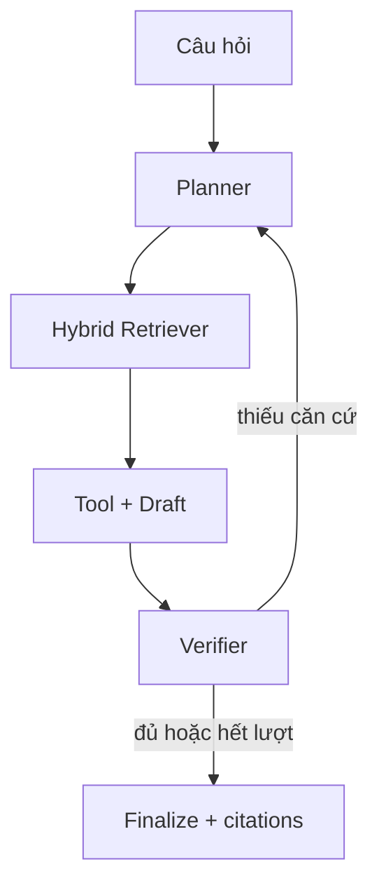

# Legal Agent VN

Trợ lý **tra cứu** pháp luật Việt Nam dùng Multi-Agent RAG: lập kế hoạch truy vấn, tìm kiếm hybrid, gọi công cụ xác định, tự kiểm định và trả lời kèm nguồn.

> Đây là dự án học thuật/prototype, không phải dịch vụ tư vấn pháp lý. Chỉ dùng văn bản có nguồn gốc, ngày hiệu lực và phạm vi áp dụng đã được kiểm chứng. Không đưa dữ liệu cá nhân hoặc bí mật vụ việc vào dịch vụ LLM bên thứ ba nếu chưa có cơ sở xử lý phù hợp.

## Kiến trúc



- Dense retrieval: BGE-M3 + Qdrant.
- Sparse retrieval: BM25 với unigram/bigram tiếng Việt.
- Fusion: Reciprocal Rank Fusion (RRF), sau đó CrossEncoder reranking.
- Generation: Gemini Developer API, có retry lỗi tạm thời và model dự phòng.
- Guardrails: giới hạn tool call/context/query, kiểm tra citation tất định, cảnh báo khi thiếu căn cứ.
- Observability: Langfuse là tùy chọn, không làm hỏng runtime khi chưa cấu hình.

## Yêu cầu

- Python **3.11 hoặc 3.12**. Không khuyến nghị 3.13 vì hệ sinh thái PyTorch/FlagEmbedding có thể chưa tương thích đồng đều.
- RAM tối thiểu khoảng 8 GB; nên có GPU nếu ingest corpus lớn.
- Dung lượng trống vài GB cho embedding/reranker tải lần đầu.
- Gemini API key từ [Google AI Studio](https://aistudio.google.com/apikey).

## Cài nhanh

### Windows PowerShell

```powershell
py -3.11 -m venv .venv
.\.venv\Scripts\Activate.ps1
python -m pip install --upgrade pip
pip install -r requirements.txt
Copy-Item .env.example .env
```

### Linux/macOS

```bash
python3.11 -m venv .venv
source .venv/bin/activate
python -m pip install --upgrade pip
pip install -r requirements.txt
cp .env.example .env
```

Mở `.env`, điền `GEMINI_API_KEY`. Tên model mặc định là endpoint ổn định được liệt kê trong [Gemini model documentation](https://ai.google.dev/gemini-api/docs/models).

Kiểm tra nhanh môi trường (không tải model):

```bash
python -m scripts.check_setup
```

## Chuẩn bị dữ liệu

Mỗi văn bản đặt trong `data/raw` dưới dạng `.md` hoặc `.txt`, kèm file metadata cùng tên:

```json
{
  "doc_id": "45/2019/QH14",
  "doc_title": "Bộ luật Lao động 2019",
  "doc_type": "code",
  "effective_status": "hiệu lực",
  "issue_date": "2019-11-20",
  "source_url": "https://nguon-chinh-thuc.example/van-ban",
  "license": "ghi rõ điều kiện sử dụng dữ liệu",
  "is_sample": false
}
```

Nội dung cần có heading `Điều 1. ...`, `Điều 2. ...`. Chạy kiểm tra trước:

```bash
python -m scripts.audit_corpus
python -m scripts.ingest_data
```

`vi_du_mau.md` chỉ là dữ liệu minh họa và bị loại khỏi ingest mặc định. Để smoke test parser/index bằng dữ liệu này:

```bash
python -m scripts.ingest_data --include-samples
```

Không dùng index smoke test để trả lời tình huống pháp lý thật.

Nếu nâng cấp từ bản dùng `bm25_index_*.pkl`, phải ingest lại một lần. Bản mới dùng `*.json.gz` có version check và không thực thi mã khi load.

Các script tải/repair dữ liệu cần dependency bổ sung:

```bash
pip install -r requirements-data.txt
python -m scripts.download_hf_datasets --help
```

## Chạy

CLI:

```bash
python main.py "Người lao động phải báo trước bao lâu khi đơn phương chấm dứt hợp đồng?"
```

Giao diện web local:

```bash
python app.py
```

Mặc định UI chỉ nghe tại `127.0.0.1` và không tạo public share link. Chỉ đổi `APP_SHARE=true` khi dữ liệu/prompt có thể được gửi qua một endpoint công khai và đã có kiểm soát truy cập phù hợp.

## Test và đánh giá

```bash
pip install -r requirements-dev.txt
pytest -q
ruff check .
```

CI dùng `requirements-test.txt` để kiểm logic nhanh mà không tải model weights nặng.

Retrieval ablation trên collection đã ingest:

```bash
python -m evaluation.evaluate_retrieval \
  --testset data/testset/sample_testset.json \
  --modes dense bm25 rrf rerank
```

End-to-end benchmark:

```bash
python -m evaluation.evaluate data/testset/sample_testset.json
```

RAGAS cần `pip install -r requirements-eval.txt`. Bộ testset mẫu chỉ minh họa schema; metric có ý nghĩa khi các `relevant_chunk_ids` thật sự tồn tại trong corpus/index được đánh giá.

## Nguyên tắc an toàn pháp lý

- Trả lời chỉ từ context được truy hồi; không đủ căn cứ thì phải từ chối khẳng định.
- Citation phải đúng cặp `Điều + tên văn bản` và tồn tại trong context.
- Metadata `effective_status` không tự chứng minh hiệu lực; cần quy trình cập nhật, lưu ngày kiểm tra và quan hệ sửa đổi/thay thế.
- `calculate_social_insurance` chỉ minh họa phép tính. Căn cứ đóng, mức trần và đối tượng áp dụng phải được xác định từ văn bản hiện hành.
- Tài liệu trong corpus là dữ liệu không tin cậy: không được coi nội dung giống câu lệnh trong văn bản là instruction cho agent.

## Cấu trúc chính

```text
agents/       workflow, LLM client, verifier, citation
ingestion/    loader, validation, legal chunking
retrieval/    embedding, Qdrant, BM25, RRF, reranker
tools/        deterministic tools
evaluation/   retrieval ablation và end-to-end metrics
scripts/      audit, download, repair, ingest
tests/        unit/regression tests
```

## Giới hạn trước khi production

- Qdrant local phù hợp demo, không phù hợp collection lớn hoặc nhiều process; production nên dùng Qdrant server/Cloud, authentication và backup.
- Chưa có xác thực người dùng, phân quyền theo corpus, rate limit, mã hóa/audit log ở tầng ứng dụng.
- Chưa có pipeline tự động xác minh văn bản hết hiệu lực, văn bản hợp nhất và quan hệ sửa đổi/bãi bỏ.
- LLM-as-judge không phải ground truth; cần bộ test do chuyên gia pháp lý gán nhãn và theo dõi regression định kỳ.
- Dự án chưa khai báo giấy phép mã nguồn. Chủ dự án cần chọn LICENSE trước khi phân phối công khai.
