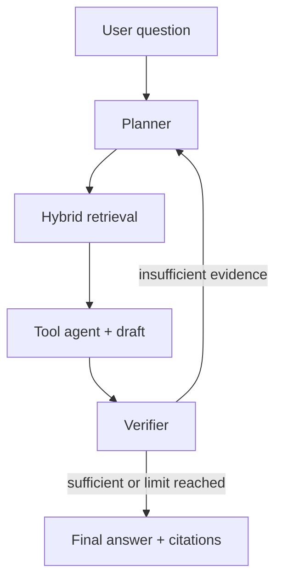
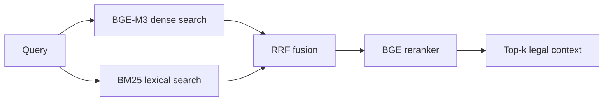

# Vietnamese Legal Retrieval & Multi-Agent RAG


A Vietnamese legal information retrieval system that combines **BM25, dense
retrieval, Reciprocal Rank Fusion, Cross-Encoder reranking, and a self-verifying
multi-agent RAG workflow**. The project was developed as an individual
**CS419 — Information Retrieval** project at the University of Information
Technology, VNU-HCM.

> [!IMPORTANT]
> This repository is an academic research prototype, not a legal-advice
> service. Legal status and applicability must be verified against official,
> up-to-date sources before relying on any generated answer.

## Results at a glance

- **94,685 indexed passages** across two isolated Qdrant collections.
- **306 legal documents → 38,732 chunks** in the main agent corpus.
- **55,953 passages** in the YuITC retrieval benchmark collection.
- **0.7293 MRR** and **0.8910 Recall@10** with RRF + Cross-Encoder reranking.
- **44 automated tests** covering chunking, retrieval fusion, agents, citations,
  tools, data validation, and download safety.

## Retrieval benchmark

The table below reports the completed retrieval ablation on **500 labeled
queries** sampled with seed `42` from the
[YuITC Vietnamese Legal Document Retrieval dataset](https://huggingface.co/datasets/YuITC/Vietnamese-Legal-Doc-Retrieval-Data).
All modes use the same benchmark corpus and relevance labels. Latency is the
observed mean per query on the current Google Colab run and should be interpreted
as environment-specific rather than a universal serving benchmark.

| Method | Recall@1 | Recall@5 | Recall@10 | Recall@30 | Hit@5 | Hit@10 | MRR | Avg. latency |
|---|---:|---:|---:|---:|---:|---:|---:|---:|
| Dense | 0.5057 | 0.7837 | 0.8590 | 0.9067 | 0.8080 | 0.8800 | 0.6489 | **426.8 ms** |
| BM25 | 0.4130 | 0.6893 | 0.7640 | 0.8573 | 0.7120 | 0.7860 | 0.5527 | 1,404.3 ms |
| RRF | 0.5250 | 0.7830 | 0.8453 | **0.9107** | 0.8060 | 0.8680 | 0.6563 | 1,763.1 ms |
| **RRF + Reranker** | **0.5937** | **0.8483** | **0.8910** | **0.9107** | **0.8740** | **0.9160** | **0.7293** | 6,956.0 ms |

### Key findings

- Dense retrieval outperformed the current BM25 implementation on every
  effectiveness metric while also achieving lower latency.
- RRF slightly improved Recall@1 and MRR over dense retrieval, but did not
  uniformly improve Recall@5/10 because BM25 was the weaker first-stage retriever
  on this dataset.
- Cross-Encoder reranking produced the strongest early-ranking quality:
  **+8.80 percentage points Recall@1** and **+8.04 points MRR** over dense
  retrieval.
- RRF and reranking have the same Recall@30 because the reranker only reorders
  the 30 candidates produced by the hybrid retriever.
- Accuracy comes with a clear latency trade-off: reranking was approximately
  **16.3× slower than dense retrieval** in this local Colab experiment.

End-to-end answer generation is currently being evaluated on a separate,
human-reviewed test set. No end-to-end quality claim is included in this README
until that evaluation is complete.

## System architecture



### Retrieval pipeline



| Stage | Implementation |
|---|---|
| Dense retrieval | BGE-M3 embeddings + Qdrant cosine search |
| Sparse retrieval | BM25 with Vietnamese unigram/bigram tokenization |
| Fusion | Reciprocal Rank Fusion over dense and sparse candidates |
| Reranking | BGE-Reranker-v2-M3 Cross-Encoder |
| Orchestration | LangGraph conditional workflow |
| Generation | Gemini Developer API with retry and fallback |
| Verification | LLM judge plus deterministic citation validation |
| Interface | CLI and Gradio web application |

## Engineering highlights

- Parses Vietnamese legislation by **Điều** (article) and **Khoản** (clause).
- Preserves repeated article/clause numbers in amendment laws using stable
  occurrence-aware chunk IDs instead of silently overwriting Qdrant points.
- Validates corpus structure, quarantines known-bad records, and repairs a known
  upstream Labor Code mismatch using source-aware fallbacks.
- Uses deterministic UUIDs and verifies the indexed point count after ingestion.
- Stores BM25 indexes as versioned gzip JSON rather than executable pickle files.
- Enforces citation support against retrieved context and abstains when evidence
  is insufficient.
- Supports reproducible Google Colab ingestion, evaluation, index backup, and
  restoration.
- Keeps the main agent corpus and the retrieval benchmark in separate collections
  to prevent evaluation leakage.

## Repository structure

```text
agents/       LangGraph workflow, planner, retriever, verifier, finalizer
ingestion/    corpus loading, validation, legal-aware chunking
retrieval/    embeddings, Qdrant, BM25, RRF, Cross-Encoder reranking
tools/        deterministic legal calculation and lookup tools
evaluation/   retrieval ablation and end-to-end evaluation
scripts/      dataset download, audit, repair, ingest, setup checks
tests/        unit and regression tests
colab/        complete Google Colab pipeline
```

## Quick start

### Option 1 — Google Colab

Open `colab/colab.ipynb`, select a T4 GPU, add a Colab secret named
`GEMINI_API_KEY`, and follow either the first-run or restore path described in
the notebook. The notebook includes full data download, ingestion, Drive backup,
retrieval evaluation, end-to-end evaluation, and Gradio demo cells.

### Option 2 — Local environment

Requirements:

- Python 3.11 or 3.12
- 16 GB system RAM is recommended for combined full-corpus experiments; on
  memory-limited Colab runtimes, run the main and benchmark collections separately
- A GPU is strongly recommended for BGE-M3 ingestion and reranking
- A Gemini API key from [Google AI Studio](https://aistudio.google.com/apikey)

After cloning this repository:

```bash
cd legal-agent-vn

python3.11 -m venv .venv
source .venv/bin/activate
python -m pip install --upgrade pip
pip install -r requirements-data.txt
cp .env.example .env
```

On Windows PowerShell, activate the environment with:

```powershell
py -3.11 -m venv .venv
.\.venv\Scripts\Activate.ps1
python -m pip install --upgrade pip
pip install -r requirements-data.txt
Copy-Item .env.example .env
```

Add your key to `.env`:

```dotenv
GEMINI_API_KEY=your_key_here
```

## Data preparation and indexing

Download both the main corpus and the labeled retrieval benchmark:

```bash
python -m scripts.download_hf_datasets --dataset all --repair_known
```

Audit and ingest the main agent corpus:

```bash
python -m scripts.audit_corpus
python -m scripts.ingest_data
```

Create the isolated benchmark collection:

```bash
python -m scripts.ingest_benchmark_corpus
```

The default collections are:

```text
vn_legal_docs                   # agent and end-to-end evaluation
vn_legal_retrieval_benchmark    # retrieval ablation only
```

## Run the application

CLI:

```bash
python main.py "Người lao động phải báo trước bao lâu khi đơn phương chấm dứt hợp đồng?"
```

Gradio:

```bash
python app.py
```

The UI exposes retrieved sources, verifier status, faithfulness score, iteration
count, and processing time instead of presenting the agent as a black box.

## Reproduce the retrieval evaluation

Run a quick 50-query smoke test:

```bash
python -m evaluation.evaluate_retrieval \
  --testset data/testset/yuitc_retrieval_testset.json \
  --collection vn_legal_retrieval_benchmark \
  --sample_size 50 \
  --modes dense bm25 rrf rerank \
  --output evaluation/retrieval_ablation_results_50.json
```

Run the 500-query experiment reported above:

```bash
python -m evaluation.evaluate_retrieval \
  --testset data/testset/yuitc_retrieval_testset.json \
  --collection vn_legal_retrieval_benchmark \
  --sample_size 500 \
  --modes dense bm25 rrf rerank \
  --output evaluation/retrieval_ablation_results.json
```

Metrics:

- `Recall@k`: fraction of relevant passages retrieved in the first `k` results.
- `Hit@k`: fraction of queries with at least one relevant result in the first
  `k` results.
- `MRR`: how early the first relevant passage appears.
- `Avg. latency`: end-to-end retrieval time for each evaluated mode.

## Tests and code quality

```bash
pip install -r requirements-test.txt
pytest -q
ruff check .
```

Current status:

```text
44 passed
All checks passed
```

## Roadmap

- [x] Corpus validation and source-aware repair
- [x] Legal article/clause chunking with collision prevention
- [x] Dense, BM25, RRF, and Cross-Encoder retrieval ablation
- [x] Deterministic citation validation and abstention guard
- [x] Reproducible Colab backup/restore workflow
- [ ] Human-reviewed 50-question end-to-end benchmark
- [ ] Baseline vs. hybrid vs. full-agent end-to-end ablation
- [ ] Human correctness, completeness, citation, and abstention scoring
- [ ] Bootstrap 95% confidence intervals and error analysis
- [ ] Qdrant server/Cloud deployment and optimized sparse retrieval

## Responsible use and limitations

- The UTS_VLC snapshot is an upstream research dataset, not an authoritative
  statement of current legal validity.
- `effective_status` metadata must be independently verified against official
  sources before real-world use.
- The current Qdrant local mode is intended for experiments and single-process
  demos, not concurrent production traffic.
- LLM-as-judge scores are diagnostic signals, not expert legal ground truth.
- The system does not yet implement authentication, authorization, rate limiting,
  encrypted audit logging, or automatic amendment/repeal tracking.
- Do not submit personal, confidential, or case-sensitive information to a
  third-party LLM without an appropriate legal basis and security controls.

## Project scope

This project demonstrates applied information retrieval and RAG engineering:
data validation, legal-aware indexing, hybrid retrieval, reranking, agentic
orchestration, grounded generation, citation verification, reproducible
experimentation, and transparent failure analysis. It does not claim a new
retrieval algorithm or production-grade legal reliability.
